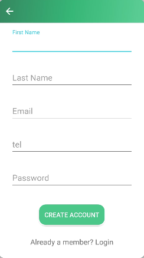
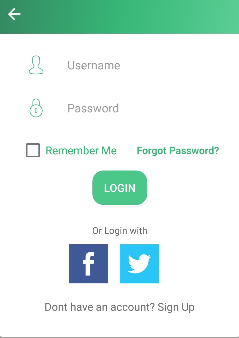
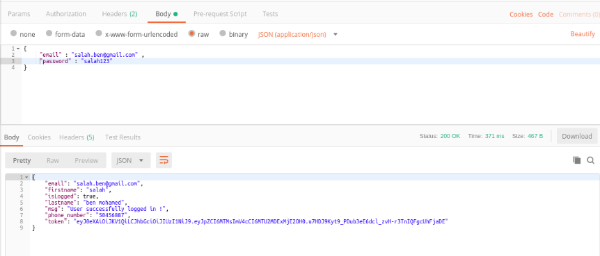
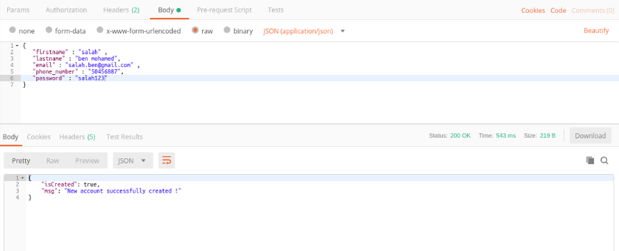

This repository contains the source code of our microservice User Management.
I am using Python  3.5.2 and SQLAlchemy.
# Step 1
 install requirements :
 $ pip install -r requirements.txt
 
# Step 2
provide the API key which is written in /user-management-microservice/static/api_key_files/api.key

# Step 3
run the app :
python run.py

Our REST API is being consumed by a mobile application.

  

I used Postman to test our microservice. Here is a snapshot of how to send requests and receive responses through our REST API:

 

